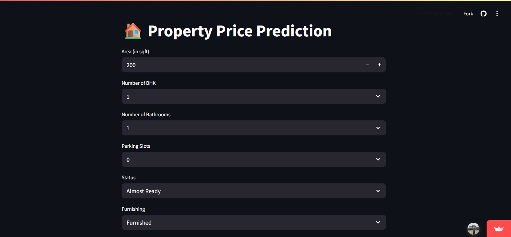

# 🏡 Property Price Prediction

A machine learning-powered web application to predict real estate prices based on user input. The app is built using Python, Streamlit, and a Decision Tree Regressor model trained on property data.



---

## 🚀 Features

- 📊 Predicts property prices based on:
  - Area (sqft)
  - Number of BHK
  - Bathrooms
  - Parking slots
  - Status (Almost Ready / Ready to Move)
  - Furnishing (Furnished / Semi-Furnished / Unfurnished)
  - Transaction type (New / Resale)
  - Property type (Apartment / Builder Floor)
- 💻 Interactive and clean UI using **Streamlit**
- 🌲 Uses Decision Tree Regressor from `scikit-learn`
- 🧪 Trained on preprocessed dataset (`filtered_data.csv`)

---

## 📦 Tech Stack

- **Frontend:** Streamlit
- **Backend:** Python, scikit-learn
- **Libraries:** Pandas, NumPy, Rich, Streamlit

---

## 🧠 How it Works

- Trained on housing dataset with feature encoding
- Uses Decision Tree Regressor for prediction
- Streamlit collects user input and makes predictions live

---

## 🛠️ Installation & Running Locally

```bash
# 1. Clone the repo
git clone https://github.com/GAURAV-RAYAT/property-price-predictor.git
cd property-price-predictor

# 2. Install dependencies
pip install -r requirements.txt

# 3. Run the Streamlit app
streamlit run app.py
```

---

## 🌍 Live Demo

You can try the live app here:  
🔗 [https://propertypriceprediction-exrzanw4irty3ytc4boxmz.streamlit.app/](https://propertypriceprediction-exrzanw4irty3ytc4boxmz.streamlit.app/)

---

## 📜 License

This project is licensed under the MIT License.

---

> Made with ❤️ by [Gaurav Rayat](https://gauravrayat.xyz)
